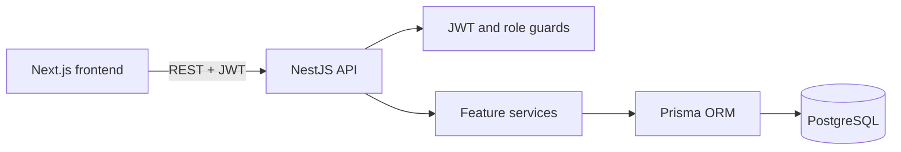

# Architecture

The repository contains two independent applications. The frontend is responsible for Vietnamese presentation, form UX, local access-token storage, and server-state caching. The backend remains authoritative for identity, roles, ownership, status, prices, availability, and booking state transitions.

## Backend modules

- `auth`: register, login, JWT strategy, current user.
- `admin`: pending-host list and approval/rejection.
- `amenities`: public amenity catalogue.
- `properties`: public discovery and active-host ownership management.
- `bookings`: guest booking, host view, payment, and cancellation.
- `prisma`: shared database lifecycle service.
- `common`: typed user, decorators, and role guard.

Controllers only translate HTTP requests. Services contain authorization-adjacent domain checks and business logic. Prisma handles persistence and transactions.

## Security model

Passport validates each access token and reloads the user from the database, so a host approval/rejection takes effect without issuing a new token. Role guards protect route groups, while services additionally enforce active-host status and property ownership. Passwords use bcrypt hashes. DTO validation whitelists input and rejects unknown fields.

## Concurrency

Payment confirmation runs at PostgreSQL `SERIALIZABLE` isolation. The transaction reloads the pending booking, ensures no successful payment exists, checks the exclusive overlap predicate, creates the deposit payment, and confirms the booking. Prisma serialization conflicts are returned as HTTP 409.
