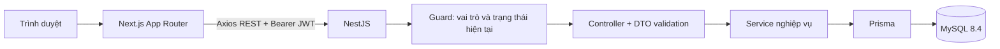

# Kiến trúc StayHub

```mermaid
flowchart LR
  U[Trình duyệt] --> F[Next.js App Router]
  F -->|Axios REST + Bearer JWT| N[NestJS]
  N --> G[Guard: vai trò và trạng thái hiện tại]
  G --> C[Controller + DTO validation]
  C --> S[Service nghiệp vụ]
  S --> P[Prisma]
  P --> D[(MySQL 8.4)]
```

Frontend dùng TypeScript, Tailwind 4, các primitive shadcn/Radix, React Hook Form + Zod, TanStack Query, Axios, date-fns, React Day Picker và Sonner. Các component UI dùng semantic tokens trong globals.css. Font Be Vietnam Pro có subset tiếng Việt. Primary giữ cam ấm; chữ trên nút dùng màu tối để đủ tương phản. Liên kết dùng cam đậm. Trạng thái dùng xanh lá/đỏ/vàng riêng.

Backend chia module auth, admin, properties, amenities, bookings, prisma; nghiệp vụ thanh toán nằm trong PaymentsService. Guard toàn cục xác minh JWT và tải tài khoản từ database mỗi request, vì vậy việc phê duyệt có tác dụng với token đã cấp. Public chỉ áp dụng cho đăng ký, đăng nhập, tìm kiếm, chi tiết chỗ nghỉ, tiện ích.

JWT access token tồn tại 8 giờ, lưu localStorage theo yêu cầu mini project. Đăng xuất xóa token và toàn bộ cache truy vấn; token hết hạn buộc xác thực lại. Không refresh token, không chỉnh sửa hồ sơ, không OAuth. Mật khẩu bcrypt 12 vòng, giới hạn 72 byte để tránh bcrypt cắt ngắn.

Giao dịch Serializable được áp dụng cho tạo đặt chỗ, thanh toán và hủy. Prisma retry tối đa 4 lần khi lỗi P2034 do deadlock/xung đột; thất bại cuối trả lỗi thân thiện. Khi hai giao dịch cùng đọc khoảng trống và cập nhật đơn, MySQL/Serializable ngăn cả hai cùng commit; giao dịch retry sẽ thấy đơn đã xác nhận. Không dùng mutex trong bộ nhớ. Payment.bookingId UNIQUE ngăn nhiều thanh toán cho cùng đơn. Cập nhật trạng thái có điều kiện và tạo payment cùng giao dịch; hủy không xóa payment.

Ảnh chỗ nghỉ là URL HTTPS; trình duyệt tải ảnh trực tiếp để không biến máy chủ thành bộ tải URL tùy ý. Next image allowlist chỉ chứa images.unsplash.com nếu dùng optimizer. Không upload hoặc lưu trữ ảnh. Ảnh demo phụ thuộc Unsplash. Build lần đầu cần mạng để next/font lấy Google Fonts.

Docker Compose chỉ chạy MySQL. Next.js và NestJS chạy bằng Node.js riêng. Tài liệu chính thức tham khảo: [Next.js installation](https://nextjs.org/docs/app/getting-started/installation), [Prisma transactions](https://docs.prisma.io/docs/orm/v7/prisma-client/queries/transactions). Dự án khóa Prisma 6.19.2 để giữ cấu hình schema datasource truyền thống; các phiên bản thực tế được khóa bằng package-lock.json.
