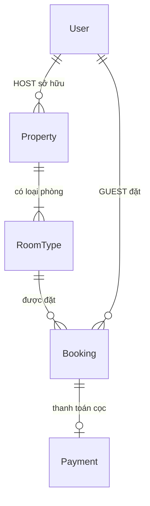
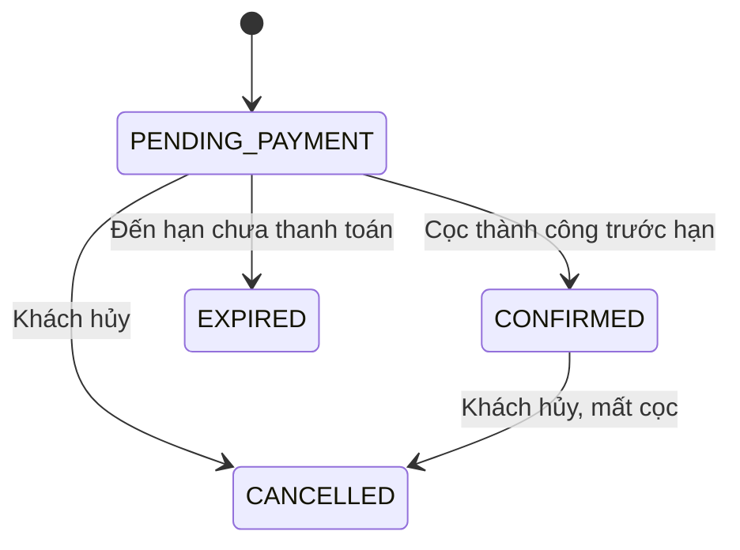

# Mô hình đặt phòng StayHub

## 1. Cơ sở lưu trú và loại phòng

`Property` là cơ sở lưu trú: tên, địa chỉ, khu vực, chủ sở hữu, ảnh, tiện ích, giờ nhận/trả phòng và chính sách cọc. `RoomType` là loại phòng hoặc chỗ ở có thể bán trong cơ sở đó.



Khách sạn có nhiều loại phòng, ví dụ phòng đôi tiêu chuẩn 10 phòng, phòng đôi cao cấp 6 phòng, phòng gia đình 3 phòng. Homestay có đúng một loại chỗ ở nguyên căn với `totalUnits = 1`. Không quản lý số phòng vật lý, phân phòng hay dọn phòng.

Giá, sức chứa, số phòng ngủ, giường và phòng tắm thuộc `RoomType`. `totalUnits` là số đơn vị có thể bán, từ 1 đến 100 cho mỗi loại. Số khách tối đa của đơn bằng `maxGuests × quantity`. Chủ nhà quản lý danh sách loại phòng ngay trong biểu mẫu chỗ nghỉ; ngừng bán thay vì xóa lịch sử. Không được giảm số lượng thấp hơn đỉnh số phòng đã giữ/xác nhận trong tương lai.

## 2. Lịch phòng theo từng đêm

Khoảng lưu trú là `[checkIn, checkOut)`: nhận ngày 10, trả ngày 12 thì chiếm đêm 10 và 11. Khách tiếp theo được nhận ngày 12.

Với mỗi đêm:

```text
occupiedUnits = tổng quantity của các đơn CONFIRMED
              + tổng quantity của các đơn PENDING_PAYMENT còn hạn
availableUnits = max(0, totalUnits - occupiedUnits)
```

Số phòng trống cho toàn kỳ là **giá trị nhỏ nhất** của tất cả các đêm. Ví dụ 10 phòng, đơn A giữ 2 phòng ngày 5–8, đơn B giữ 3 phòng ngày 6–9: phòng trống các đêm 5, 6, 7, 8, 9 lần lượt là 8, 5, 5, 7, 10. Không cộng tất cả đơn giao nhau rồi trừ một lần.

Đơn hủy, hết hạn và đơn pending đã quá hạn đều không chiếm phòng. Quy tắc giống nhau cho hotel và homestay. Nếu bất kỳ đêm nào thiếu phòng thì từ chối toàn bộ đơn với HTTP 409.

Trước khi chọn ngày, giao diện chỉ yêu cầu chọn ngày để kiểm tra. Sau khi chọn, backend trả số phòng trống và báo giá; lịch hiển thị số phòng từng đêm. Ngày hết phòng vẫn có thể là ngày trả phòng.

## 3. Giá và snapshot

```text
totalAmount = nightlyPriceSnapshot × quantity × totalNights
depositAmount = ceil(totalAmount × depositPercentSnapshot / 100)
remainingAmount = totalAmount - depositAmount
```

Đơn lưu tên loại phòng, số lượng, giá, số đêm, tỷ lệ cọc, số tiền và giờ nhận/trả phòng lúc đặt. Chủ nhà đổi giá hoặc giờ sau đó không làm thay đổi đơn cũ. Tối đa 365 đêm; tổng tiền không vượt 2.147.483.647 đồng theo kiểu số hiện tại.

Giá “Từ” trên danh sách là `MIN(pricePerNight)` của các loại phòng ACTIVE. Lọc và sắp xếp giá cũng dùng đúng giá trị này; cơ sở không có loại phòng đang mở bán không xuất hiện trong kết quả tìm kiếm.

## 4. Giữ phòng và hạn cọc

Chủ nhà chọn `paymentWindowHours`: 1, 3, 6, 12 hoặc 24 giờ. Mặc định 6 giờ. Backend là nguồn quy tắc; frontend lấy cấu hình qua `/bookings/policy`.

Giờ nhận phòng dùng UTC+7. Thời gian chuẩn bị tối thiểu mặc định 2 giờ. Nếu giờ nhận phòng cách hiện tại không quá 2 giờ thì không tạo đơn.

Nếu còn không quá 24 giờ trước nhận phòng, cửa sổ thanh toán tối đa 1 giờ. Sau đó tính:

```text
paymentDeadlineAt = min(
  thời điểm tạo đơn + cửa sổ thanh toán áp dụng,
  giờ nhận phòng - thời gian chuẩn bị tối thiểu
)
```

Đúng thời điểm deadline đã là hết hạn. Bộ đếm trên giao diện chỉ để thông báo; backend kiểm tra lại trước khi thu cọc. Thanh toán giả lập chỉ thu cọc, không thu tổng tiền và không kết nối cổng thanh toán thật.

## 5. Trạng thái và hết hạn



`EXPIRED` và `CANCELLED` không được thanh toán hoặc kích hoạt lại. Hủy đơn đã xác nhận giữ bản ghi Payment SUCCESS, không hoàn tiền.

`InventoryService` dùng vòng lặp 60 giây trong lifecycle NestJS, chạy cả khi frontend đóng; lúc khởi động cũng quét đơn quá hạn. Mỗi đợt tối đa 100 khách để tránh transaction dài. `expiredAt` ghi thời điểm deadline, kể cả khi tiến trình khởi động muộn.

Đọc lịch, lịch sử, quyền đặt hoặc thử thanh toán cũng xử lý hết hạn. Khi thanh toán quá hạn bị từ chối, thay đổi EXPIRED vẫn được commit. Dù lịch quét chậm, truy vấn tồn phòng luôn loại pending đã quá deadline nên không giữ phòng sai.

## 6. Chống giữ phòng quá nhiều

Mỗi khách tối đa 2 đơn pending còn hạn trên toàn hệ thống. Không tính đơn đã xác nhận, hủy hoặc hết hạn. Cùng khách không được có hai đơn pending giao ngày trên cùng loại phòng.

Ba lần hết hạn chưa thanh toán trong 30 ngày dẫn đến tạm khóa đặt mới 24 giờ. Hủy chủ động không tính. `bookingBlockedUntil` lưu hạn khóa; `expirationStrikeResetAt` đánh dấu các lần đã dùng để áp dụng khóa, tránh khóa lại ngay khi hết 24 giờ. Khách vẫn xem lịch sử và thanh toán đơn hợp lệ đang có.

Các biến môi trường (backend):

| Biến                             | Mặc định |
| -------------------------------- | -------: |
| `BOOKING_MINIMUM_LEAD_HOURS`     |        2 |
| `BOOKING_EXPIRATION_THRESHOLD`   |        3 |
| `BOOKING_EXPIRATION_PERIOD_DAYS` |       30 |
| `BOOKING_BLOCK_HOURS`            |       24 |

## 7. Transaction và API

Tạo đơn/thanh toán dùng transaction Serializable, retry tối đa 5 lần khi P2034. Khóa hàng User chống vượt hạn mức qua các yêu cầu song song; khóa hàng Property phối hợp thay đổi tồn phòng của host với đặt/phí cọc. Đây là khóa theo cơ sở đơn giản, phù hợp mini project. Ràng buộc Payment.bookingId duy nhất chống thu cọc hai lần.

| API                                                                              | Nội dung                                                             |
| -------------------------------------------------------------------------------- | -------------------------------------------------------------------- |
| `GET /api/properties`                                                            | Danh sách, `minPricePerNight`, các loại phòng ACTIVE                 |
| `GET /api/properties/:slug`                                                      | Chi tiết và `roomTypes`                                              |
| `POST/PATCH /api/host/properties[/id]`                                           | Quản lý cơ sở, `paymentWindowHours`, danh sách `roomTypes` lồng nhau |
| `GET /api/room-types/:id/availability?checkIn=YYYY-MM-DD&checkOut=YYYY-MM-DD`    | `days[]`, `availableUnits`, `totalUnits`, `serverNow`                |
| `GET /api/room-types/:id/quote?checkIn=...&checkOut=...&quantity=2&guestCount=4` | Giá snapshot dự kiến, phòng trống, deadline dự kiến                  |
| `GET /api/bookings/policy`                                                       | Quy tắc công khai                                                    |
| `GET /api/bookings/eligibility`                                                  | Số đơn pending, hạn khóa và quyền đặt của khách                      |
| `POST /api/bookings`                                                             | `{roomTypeId, quantity, guestCount, checkIn, checkOut}`              |
| `POST /api/bookings/:id/pay`                                                     | Cọc giả lập, backend kiểm tra hạn và trạng thái                      |
| `PATCH /api/bookings/:id/cancel`                                                 | Hủy, giải phóng phòng                                                |
| `GET /api/bookings/my`, `GET /api/host/bookings`                                 | Lịch sử với tên loại phòng snapshot, số lượng và deadline            |

Không gửi `propertyId` hay giá từ frontend khi tạo đơn. Quote không giữ phòng; transaction tạo đơn kiểm tra lại toàn bộ. Frontend refetch khi đổi loại phòng/ngày/số lượng, sau các mutation, khi trở lại tab, và định kỳ (lịch/báo giá 15 giây, lịch sử 10 giây).

## 8. Migration và dữ liệu mẫu

Migration `202610040003_room_inventory` tạo loại phòng đầu tiên cho mỗi chỗ nghỉ cũ (số lượng 1), chuyển booking sang loại phòng đó và giữ tiền/Payment lịch sử. **Pending cũ được đổi thành EXPIRED tại thời điểm chuyển đổi**, vì mô hình cũ không giữ tồn phòng và có thể có nhiều yêu cầu trùng nhau. Những lần hết hạn chuyển đổi này không tính vào chống lạm dụng. Đơn confirmed/cancelled giữ nguyên trạng thái.

Seed chỉ mở rộng các cơ sở demo nhận diện được, giữ chỉnh sửa của host và không xóa booking. Dữ liệu mới gồm 38 cơ sở: 12 hotel, 26 homestay; 62 loại phòng, tổng 254 đơn vị. Hotel có 10 phòng tiêu chuẩn, 6 cao cấp, 3 gia đình. Phân bố: Thủ Đức 7, Quận 1 7, Quận 2 6, Bình Thạnh 6, Quận 7 5, Quận 3 3, Gò Vấp 2, Phú Nhuận 2.

Năm đơn confirmed tổng hợp, thuộc khách `inventory-demo@stayhub.local`, minh họa còn 5 phòng tiêu chuẩn, còn 1 phòng cao cấp, hết phòng gia đình một đêm, homestay hết phòng và hai kỳ sát nhau. Ngày demo là 14–18 ngày sau lần seed tạo đơn đầu tiên. Seed lại giữ nguyên ngày và lịch sử; không tự dịch ngày các đơn cũ.

Seed mở rộng giữ nguyên năm đơn trên, thêm một đơn để minh họa mức vàng (3 phòng), một đơn confirmed đã trả phòng có đánh giá và một đơn pending có deadline sáu giờ. Tổng cộng tám đơn demo. Pending tự hết hạn theo chính sách hiện có; seed lại không mở lại đơn hoặc dịch deadline.

Migration bổ sung `202610050001_business_features` và hướng dẫn hồ sơ, mã đặt chỗ, QR, hóa đơn, đánh giá, quản trị: [business-features.md](business-features.md). Kết quả kiểm thử thực tế: [verification.md](verification.md).
