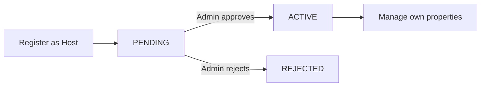

# Business flows

## Host approval



A pending host may authenticate and see the account status, but both the frontend and backend prevent property management.

## Booking and payment

```mermaid
sequenceDiagram
  participant G as Guest
  participant API as NestJS API
  participant DB as PostgreSQL
  G->>API: Create booking (property, dates, guests)
  API->>DB: Validate active property and confirmed overlap
  API->>DB: Store price/deposit snapshots as PENDING_PAYMENT
  G->>API: Fake-pay deposit
  API->>DB: Begin SERIALIZABLE transaction
  API->>DB: Re-check confirmed overlap and successful payment
  alt available
    API->>DB: Create SUCCESS payment for deposit only
    API->>DB: Set booking CONFIRMED
  else dates taken
    API-->>G: 409 Conflict; payment not created
  end
```

Overlap uses `existing.checkIn < newCheckOut AND existing.checkOut > newCheckIn`. Therefore checkout and another check-in on the same date are adjacent, not overlapping.

## Cancellation

- `PENDING_PAYMENT` becomes `CANCELLED` without payment.
- `CONFIRMED` becomes `CANCELLED`; its successful deposit payment remains and there is no refund endpoint.
- Cancelled bookings no longer block availability.
