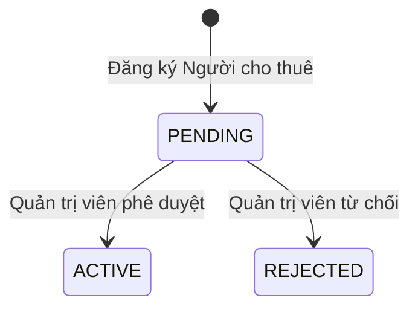
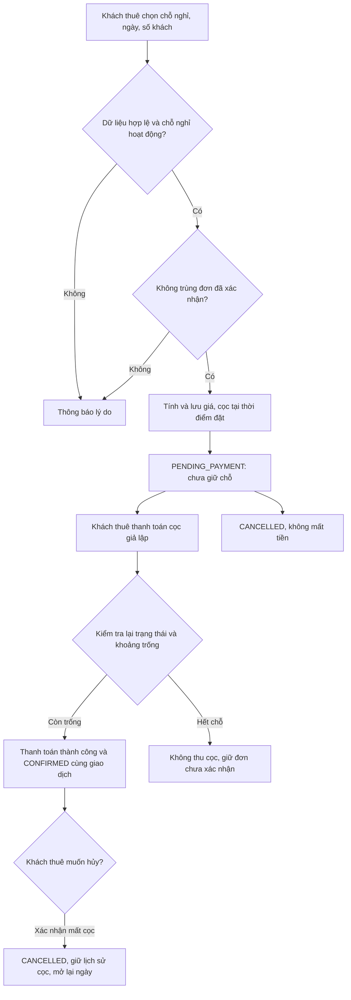

# Luồng nghiệp vụ

```mermaid
stateDiagram-v2
  [*] --> PENDING: Đăng ký Người cho thuê
  PENDING --> ACTIVE: Quản trị viên phê duyệt
  PENDING --> REJECTED: Quản trị viên từ chối
```

Khách thuê được kích hoạt và đăng nhập ngay khi đăng ký. Người cho thuê đang chờ hoặc bị từ chối vẫn đăng nhập được để xem trạng thái, nhưng không quản lý chỗ nghỉ. Không có chuyển REJECTED sang ACTIVE.

```mermaid
flowchart TD
  A[Khách thuê chọn chỗ nghỉ, ngày, số khách] --> B{Dữ liệu hợp lệ và chỗ nghỉ hoạt động?}
  B -->|Không| E[Thông báo lý do]
  B -->|Có| C{Không trùng đơn đã xác nhận?}
  C -->|Không| E
  C -->|Có| D[Tính và lưu giá, cọc tại thời điểm đặt]
  D --> P[PENDING_PAYMENT: chưa giữ chỗ]
  P --> F[Khách thuê thanh toán cọc giả lập]
  F --> G{Kiểm tra lại trạng thái và khoảng trống}
  G -->|Còn trống| H[Thanh toán thành công và CONFIRMED cùng giao dịch]
  G -->|Hết chỗ| I[Không thu cọc, giữ đơn chưa xác nhận]
  H --> J{Khách thuê muốn hủy?}
  J -->|Xác nhận mất cọc| K[CANCELLED, giữ lịch sử cọc, mở lại ngày]
  P --> L[CANCELLED, không mất tiền]
```

Khoảng trùng: existing.checkIn < new.checkOut và existing.checkOut > new.checkIn. Chỉ CONFIRMED giữ chỗ. Đơn trả phòng ngày 15 cho phép đơn khác nhận phòng ngày 15. Nhiều PENDING_PAYMENT có thể cùng ngày; thanh toán hợp lệ đầu tiên thắng. Giá cập nhật sau này không làm thay đổi snapshot của đơn cũ. Host chỉ xem đơn thuộc chỗ nghỉ mình sở hữu.

Tạm ngưng chỗ nghỉ ẩn khỏi danh sách/chi tiết công khai và chặn đặt mới/thanh toán đơn chờ; dữ liệu cũ vẫn giữ nguyên. Đơn đã xác nhận không tự bị hủy khi Host tạm ngưng.
