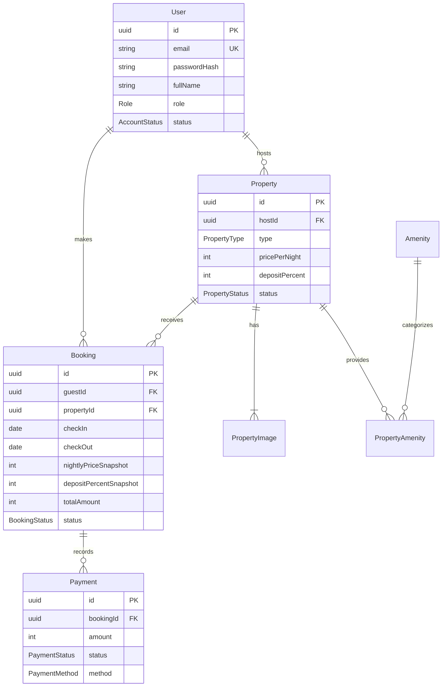

# Entity relationship diagram

Money is stored as integer VND. UUIDs are used for primary and foreign keys. `PropertyAmenity` is an explicit many-to-many join. Historical booking amounts never depend on later property edits.
