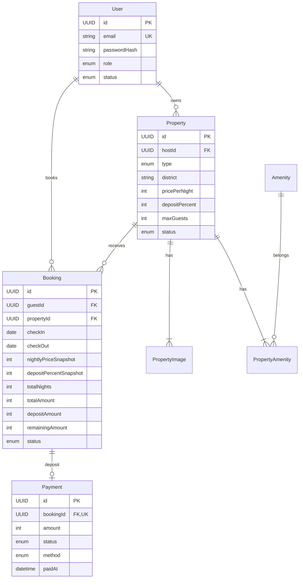

# Mô hình dữ liệu

```mermaid
erDiagram
  User ||--o{ Property : owns
  User ||--o{ Booking : books
  Property ||--|{ PropertyImage : has
  Property ||--|{ PropertyAmenity : has
  Amenity ||--o{ PropertyAmenity : belongs
  Property ||--o{ Booking : receives
  Booking ||--o| Payment : deposit
  User {
    UUID id PK
    string email UK
    string passwordHash
    enum role
    enum status
  }
  Property {
    UUID id PK
    UUID hostId FK
    enum type
    string district
    int pricePerNight
    int depositPercent
    int maxGuests
    enum status
  }
  Booking {
    UUID id PK
    UUID guestId FK
    UUID propertyId FK
    date checkIn
    date checkOut
    int nightlyPriceSnapshot
    int depositPercentSnapshot
    int totalNights
    int totalAmount
    int depositAmount
    int remainingAmount
    enum status
  }
  Payment {
    UUID id PK
    UUID bookingId FK,UK
    int amount
    enum status
    enum method
    datetime paidAt
  }
```

- UUID lưu CHAR(36); email UNIQUE; utf8mb4_unicode_ci hỗ trợ tiếng Việt và tìm kiếm không phân biệt hoa thường.
- User role: GUEST/HOST/ADMIN. VISITOR chỉ là tác nhân nghiệp vụ.
- AccountStatus: PENDING/ACTIVE/REJECTED. PropertyStatus: ACTIVE/INACTIVE.
- BookingStatus: PENDING_PAYMENT/CONFIRMED/CANCELLED.
- Tiền là số nguyên VND, không dùng float. Cọc = ceil(tổng × phần trăm / 100). Chênh lệch trả tại chỗ nghỉ.
- Ngày check-in/out lưu DATE, diễn giải theo lịch Việt Nam, checkout exclusive. Giới hạn 365 đêm; tổng tiền không vượt Int32.
- PropertyImage có sortOrder, UNIQUE(propertyId, sortOrder). PropertyAmenity dùng khóa ghép. Một Property là một đơn vị đặt độc lập, kể cả HOTEL.
- Payment một-một với Booking trong luồng giả lập. FAILED có trong enum dự phòng; xung đột không tạo payment thành công hoặc payment rác.
- Index tìm kiếm và overlap nằm trong schema.prisma. Không hard-delete chỗ nghỉ qua API.

| Model                                   | Use case                                               |
| --------------------------------------- | ------------------------------------------------------ |
| User                                    | UC-01,02,03,04,05,17; phân quyền tất cả luồng riêng tư |
| Property                                | UC-06,07,08,09,10,11,12,16                             |
| PropertyImage, Amenity, PropertyAmenity | UC-06,07,09,10                                         |
| Booking                                 | UC-12,13,14,15,16                                      |
| Payment                                 | UC-14,15                                               |
